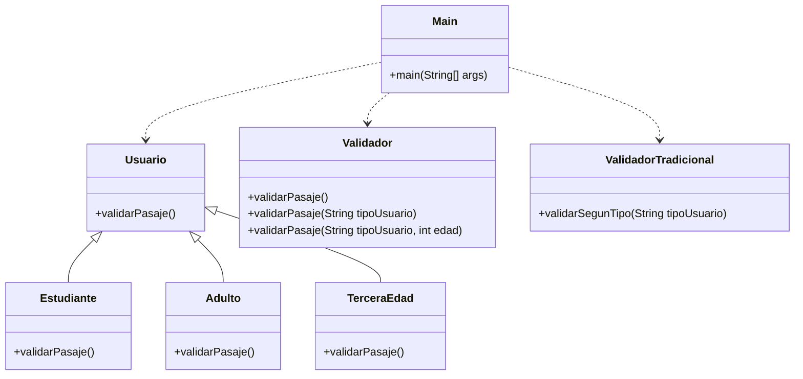

# Diagrama de clases - validacionpasajes

## Descripción

- `Usuario` es la clase base.
- `Estudiante`, `Adulto` y `TerceraEdad` heredan de `Usuario` y sobrescriben `validarPasaje()`.
- `Validador` contiene sobrecarga de métodos para validar pasajes según distintos parámetros.
- `ValidadorTradicional` usa condicionales para decidir la tarifa según el tipo de usuario.
- `Main` prueba ambas estrategias: tradicional y con polimorfismo.
